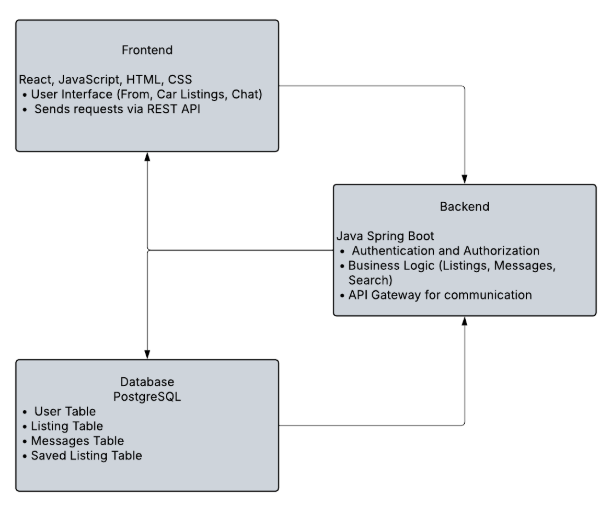

# AutoHaven

AutoHaven is a full-stack car buying web platform tailored for college students. It helps students find affordable used cars nearby, score deals using a custom price model, and navigate the buying process in Cuyahoga County.

## What Does It Do?

- Car listing and search interface
- Custom price scoring model using ML (TensorFlow.js)
- Authentication and user sessions
- In-app messaging between buyers and sellers
- Finance guide for student buyers
- Easy-to-use frontend built for non-technical users

## Architecture Overview



## Getting Started (Development)

```bash
# Clone the repo
git clone https://github.com/your-org/autohaven.git
cd AutoHaven

# Install dependencies
npm install

# Start development mode
npm run dev
```

In development:
- Frontend: http://localhost:5173
- Backend API: http://localhost:5001/api/health

Frontend is served via Vite. Backend API is served via Express.

## Production Build and Run

```bash
# Build frontend and backend
npm run build

# Start production server
npm run start
```

In production, the entire application is served from:
- http://localhost:5001

## Folder Structure

```
AutoHaven/
├── client/               # Frontend (React + Vite)
│   ├── index.html
│   └── src/
│       ├── App.tsx
│       ├── components/
│       ├── hooks/
│       ├── pages/
│       └── main.tsx
├── server/               # Backend (Express + Drizzle)
│   ├── index.ts
│   ├── routes/
│   └── vite.ts
├── shared/               # Shared types and schemas
├── attached_assets/      # Uploaded images and icons
├── dist/public/          # Final production build
├── package.json
├── vite.config.ts
├── tailwind.config.ts
├── tsconfig.json
```

## Tech Stack

- **Frontend**: React, TypeScript, Vite, Tailwind CSS, Wouter, Framer Motion
- **Backend**: Express, TypeScript, Drizzle ORM, Passport.js
- **Database**: PostgreSQL
- **Dev Tools**: Vitest, React Testing Library, ESLint, tsx
- **ML**: TensorFlow.js for car price scoring

## Contributors

| Name                  | Role                          |
|-----------------------|-------------------------------|
| Attiksh Ansool Panda  | Backend, DevOps, Architecture |
| Deep Desai            | Frontend and UI/UX            |
| Daniel Tayman         | Database and ML Model         |

## Development Retrospective

- Removed reliance on plugin-based theming
- Replaced dynamic color loading with CSS custom properties in index.css
- Simplified Vite + Express integration for a smoother build and dev process
- Could have planned CI/CD earlier to reduce deployment time crunch

## Development Challenges (Please Read - Very Important)

One major challenge we encountered was a persistent issue with GitHub access for one of our teammates early in the project. This caused significant disruption in our collaboration flow, as that team member was unable to push or pull code properly and had to work entirely on their local device.

To work around this, we resorted to manually sharing updated files and working in parallel on separate machines. While not ideal, this approach allowed each member to continue contributing despite the syncing difficulties.

We communicated this limitation to the TA team from day one and consistently mentioned it during all milestone demos. Although we intended to fully resolve the GitHub access issue before the final submission, the problem persisted.

As a result, all final code has been reviewed, consolidated, and submitted from Attiksh’s account to ensure a clean, unified submission.

## License

MIT License.